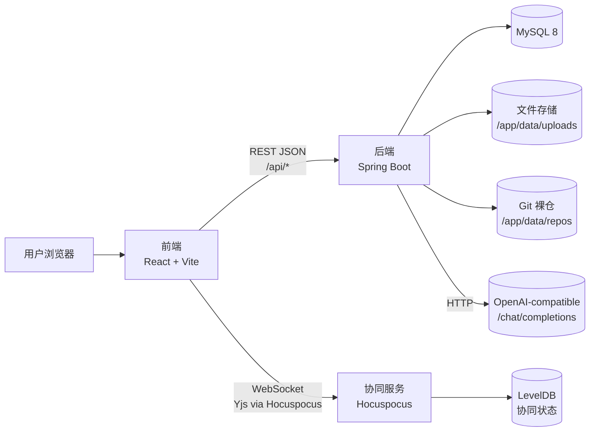
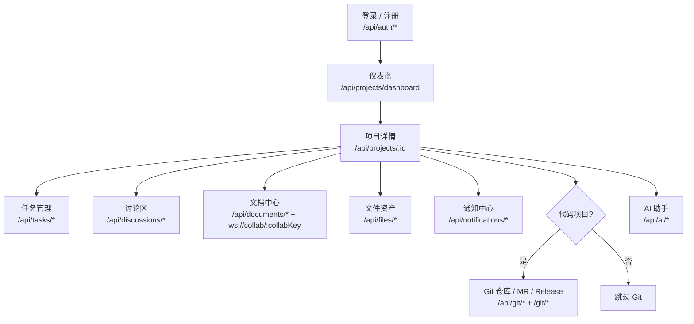
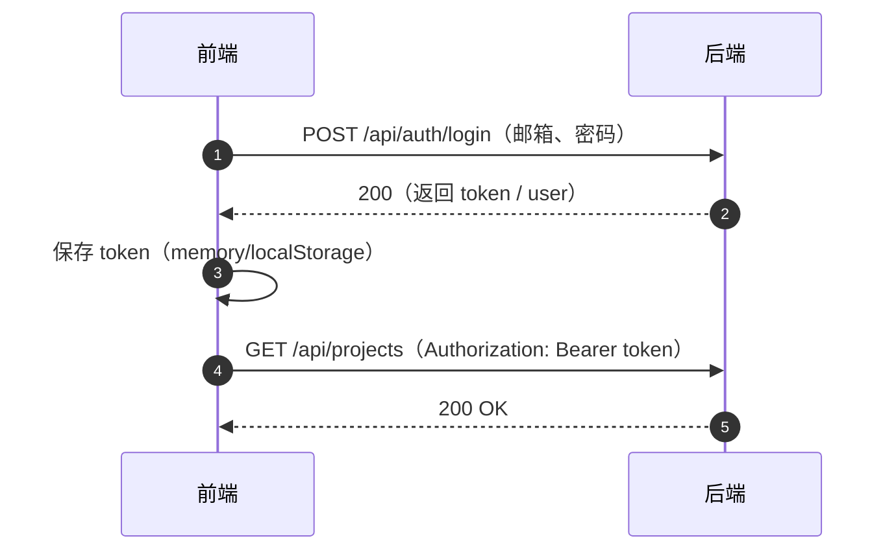
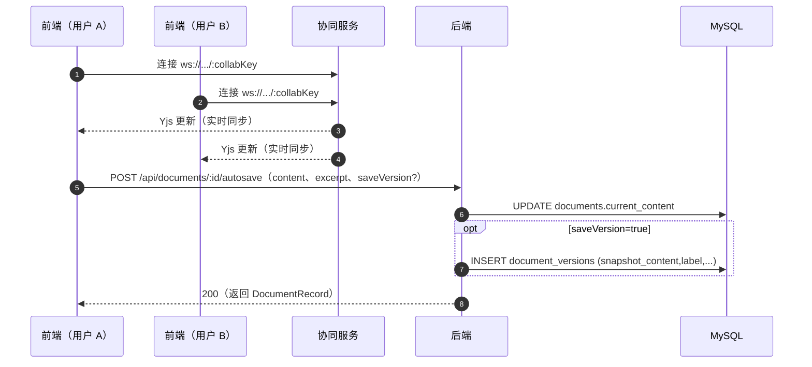
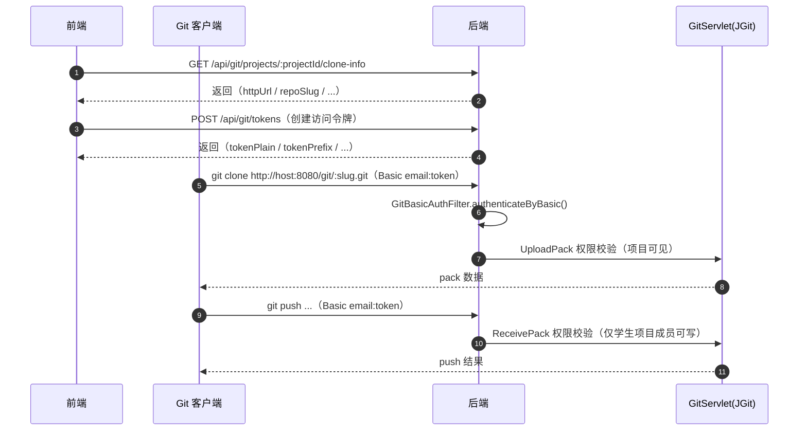
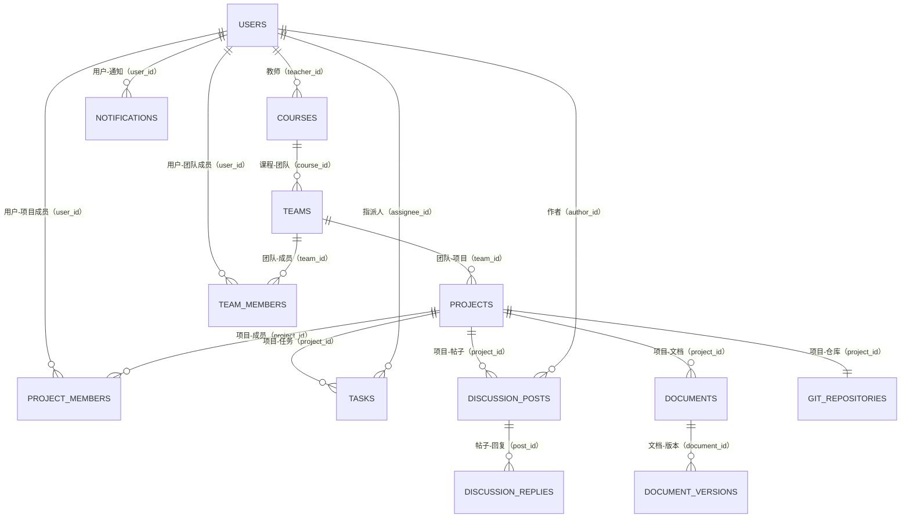

# EduCollab

面向课程/团队协作的一体化平台：**团队 / 项目 / 任务 / 讨论 / 协同文档 / 文件 / 通知 / Git / AI** 全流程闭环。

这份 README 以“成熟项目交接文档”的标准来写：你可以用它快速跑起来，也可以据此定位模块边界、关键链路和排障入口。图形全部使用 GitHub/GitLab 可直接渲染的 **Mermaid**。

---

## 目录

- [能力概览](#能力概览)
- [技术栈](#技术栈)
- [快速开始](#快速开始)
- [架构](#架构)
- [关键流程](#关键流程)
- [数据模型](#数据模型)
- [模块边界与接口](#模块边界与接口)
- [配置](#配置)
- [排障](#排障)
- [测试](#测试)
- [仓库结构与源码导航](#仓库结构与源码导航)

---

## 能力概览

- **身份与权限**：JWT 鉴权，接口分层（学生/教师）、Git Smart HTTP 单独走 Basic Token
- **项目空间**：项目/成员/任务（状态流转）/讨论（回复 + 任务关联）/通知
- **协同文档**：Yjs 实时协同 + 后端元数据与版本快照（版本恢复）
- **文件资产**：上传/下载，绑定到项目、任务、文档、讨论（多态归属）
- **Git**：JGit 托管裸仓、分支/提交树/MR/Release 基础流程 + Git Smart HTTP
- **AI 助手**：OpenAI-compatible 接口，未配置 Key 时明确报错

> 备注：仓库已移除会议模块（无会议页面/表/AI/导航残留）。

---

## 技术栈

| 模块 | 技术栈 |
|---|---|
| Frontend | React 19 + Vite 6 + React Router + React Query + Tailwind CSS + shadcn/base-ui |
| Backend | Spring Boot 3 + Spring Security（JWT）+ JPA + MySQL + JGit |
| Collab | Hocuspocus + Yjs + y-leveldb（LevelDB 持久化） |

---

## 快速开始

### 端口与地址

| 运行方式 | Frontend | Backend | Collab | MySQL |
|---|---:|---:|---:|---:|
| 本机开发（dev） | `http://localhost:3000` | `http://localhost:8080` | `ws://localhost:1234` | `localhost:3306` |
| Docker 演示（compose） | `http://localhost:5173`（容器内 Nginx 80） | `http://localhost:8080` | `ws://localhost:1234` | `localhost:3306` |

### 默认演示账号

- 学生：`alex@educollab.local` / `Password123!`
- 教师：`teacher@educollab.local` / `Password123!`

### Docker Compose（推荐：演示/答辩/快速体验）

```bash
cp .env.example .env
docker compose up --build
```

### 单容器镜像（Monolith：一个镜像/一个容器，便于部署）

> 说明：该模式会在 **同一个容器** 内启动 Nginx（前端静态 + 反代）、Backend、Collab、MariaDB。
> 默认只暴露一个端口：对外 `:8080`（容器内 `:80`）。

构建镜像：

```bash
docker build -f Dockerfile.monolith -t educollab:monolith .
```

启动（带持久化卷）：

```bash
docker run -d --name educollab-monolith \
  -p 8080:80 \
  -v educollab_monolith_data:/app/data \
  -v educollab_monolith_db:/var/lib/mysql \
  educollab:monolith
```

访问：

- 前端：`http://localhost:8080`
- 后端健康检查：`http://localhost:8080/actuator/health`

### 本机一键启动（推荐：开发调试）

依赖：MySQL、Node.js、npm、Java 21、Maven

```bash
chmod +x scripts/*.sh
./scripts/dev-local-up.sh
```

停止：

```bash
./scripts/dev-local-down.sh
```

日志：`.local-run/`（`backend.log` / `frontend.log` / `collab-server.log`）

---

## 架构

### 组件与边界（Mermaid）



---

## 关键流程

### 项目空间日常闭环（Mermaid）



---

## 关键链路（时序图）

### 登录与鉴权（JWT）



### 协同文档：实时编辑 + 自动保存 + 版本快照



### Git Clone / Pull / Push（Smart HTTP + Basic Token）



---

## 数据模型

完整表结构见 `backend/src/main/resources/schema.sql`；这里仅画核心关系（交接最常用子集）。



补充：
- `file_assets` 通过 `owner_type + owner_id` 绑定不同资源（PROJECT/TASK/DOCUMENT/DISCUSSION_POST），属于多态关联，ER 图不强行画线。

---

## 模块边界与接口

### 职责边界（数据所有权）

| 模块 | 负责什么 | 不负责什么 |
|---|---|---|---|
| Frontend | 路由/视图/状态、调用后端 API、连接协同服务、展示 Git/AI 结果 | 不直接访问 DB/文件系统/裸仓 |
| Backend | 鉴权、业务聚合、持久化、文件上传下载、JGit 托管、AI 调用封装 | 不做 Yjs 同步（交给 collab-server） |
| Collab Server | Yjs 文档实时同步与持久化（LevelDB） | 不做业务鉴权/权限（需要的话作为扩展点实现） |

### API 概览（按 Controller 入口导航）

| 功能 | 前缀 | Controller（锚点） |
|---|---|---|
| 鉴权/会话 | `/api/auth/*` | `backend/src/main/java/com/educollab/controller/AuthController.java` |
| 用户/课程/团队 | `/api/users/*` `/api/courses/*` `/api/teams/*` | `UserController` / `CourseController` / `TeamController` |
| 项目/仪表盘 | `/api/projects/*` | `ProjectController` |
| 任务 | `/api/tasks/*` | `TaskController` |
| 讨论 | `/api/discussions/*` | `DiscussionController` |
| 文档（含版本） | `/api/documents/*` | `DocumentController` |
| 文件资产 | `/api/files/*` | `FileController` |
| 通知 | `/api/notifications/*` | `NotificationController` |
| 教师端 | `/api/teacher/*` | `TeacherController` |
| Git 管理 API | `/api/git/*` | `GitController` |
| Git Smart HTTP | `/git/*` | `GitHttpConfig`（Servlet 注册） |
| AI | `/api/ai/*` | `AiController` |

---

## 配置

以 `.env.example` 为准（Docker / 本机都建议先复制一份 `.env`）：

```bash
cp .env.example .env
```

### 环境变量速查

| 变量 | 用途 |
|---|---|
| `DB_URL` / `DB_USERNAME` / `DB_PASSWORD` | 后端数据源 |
| `JWT_SECRET` | JWT 签名密钥（建议 ≥ 32 bytes） |
| `AI_PROVIDER` / `AI_BASE_URL` / `AI_API_KEY` / `AI_MODEL` | AI Provider（OpenAI-compatible） |
| `FILE_STORAGE_ROOT` / `GIT_REPO_ROOT` | 文件上传与裸仓根目录（Docker 默认 `/app/data/*`） |
| `COLLAB_PORT` / `COLLAB_DATA_DIR` | 协同服务端口与 LevelDB 目录 |
| `VITE_API_BASE_URL` / `VITE_COLLAB_BASE_URL` | 前端连接后端与协同服务的基址 |

### 坑点：`VITE_API_BASE_URL` 可以写到 `/api`，前端会自动去重

`.env.example` 默认是 `VITE_API_BASE_URL=http://localhost:8080/api`。前端会把末尾 `/api` 规范化，避免出现 `/api/api/...`。

---

## 排障

### 常见问题

1) **端口占用**
- 本机 dev：3000/8080/1234/3306
- Docker：5173/8080/1234/3306

2) **本机 MySQL 未启动**
- `scripts/dev-local-up.sh` 会提示：`brew services start mysql`

3) **AI 调用失败 / 没配置 Key**
- 后端会明确报错：`AI 模型未配置，请设置 API Key`
- 入口：`backend/src/main/java/com/educollab/service/AiService.java`

4) **Git clone/push 401/403**
- `/git/*` 走 Basic Token（不是 JWT）
- 权限规则：项目可见性（读）+ 学生项目成员（写），教师只读
- 入口：`backend/src/main/java/com/educollab/common/config/GitHttpConfig.java`

5) **协同文档不同步/丢数据**
- 检查 `VITE_COLLAB_BASE_URL` 是否指向正确 ws 地址
- Collab 持久化目录：`COLLAB_DATA_DIR`（默认 `collab-server/data/` 或 Docker 的 `/app/data/collab`）
- 入口：`collab-server/src/index.js`

> 备注：后端存在 `WebSocketConfig`（`/ws/notifications` STOMP broker），当前仓库未见业务侧消息推送实现；作为预留扩展点对待。

---

## 测试

### Frontend

```bash
cd frontend
npm run build
npm run lint
```

### Backend

```bash
cd backend
mvn -Dmaven.repo.local=/tmp/educollab-m2 test
```

### 最小冒烟 Checklist

- [ ] 能用默认账号登录
- [ ] 能进入仪表盘并打开项目详情
- [ ] 能创建/更新一个任务
- [ ] 能打开文档并产生 autosave（查看 Network 调用 `/api/documents/:id/autosave`）
- [ ] 代码项目能看到 clone-info，并能用 token 进行 git clone（只需验证一次）

---

## 仓库结构与源码导航

```text
├── frontend/        # React 前端（Vite dev: 3000 / Docker: Nginx 80->5173）
├── backend/         # Spring Boot 后端（8080）
├── collab-server/   # Hocuspocus 协同服务（1234）
├── scripts/         # 本机一键启动脚本（.local-run 日志）
├── docker-compose.yml
└── .env.example
```

### 关键入口（建议从这里读代码）

- 前端 API 客户端：`frontend/src/lib/api.ts`
- 前端环境与 URL 规范化：`frontend/src/lib/mappers.ts`
- 后端配置：`backend/src/main/resources/application.yml`
- 安全与鉴权：`backend/src/main/java/com/educollab/common/config/SecurityConfig.java`
- JWT：`backend/src/main/java/com/educollab/common/security/JwtService.java`
- 文档 API：`backend/src/main/java/com/educollab/controller/DocumentController.java`
- Git Smart HTTP：`backend/src/main/java/com/educollab/common/config/GitHttpConfig.java`
- 协同服务：`collab-server/src/index.js`
