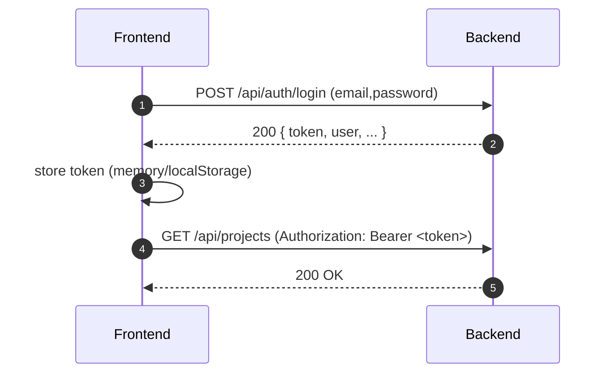
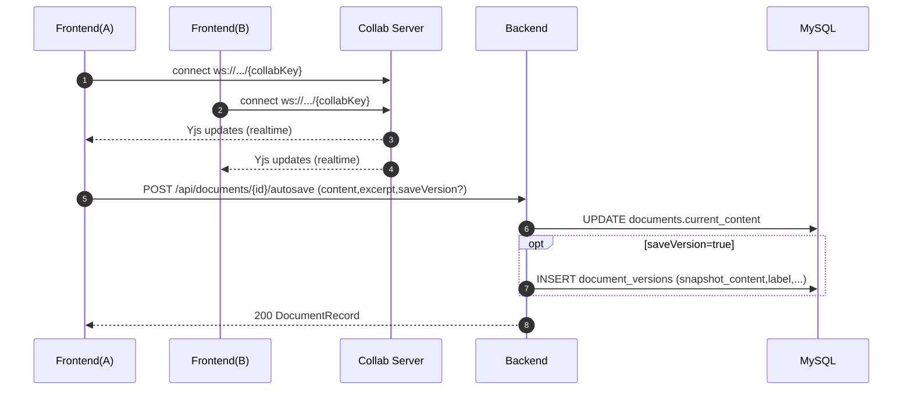
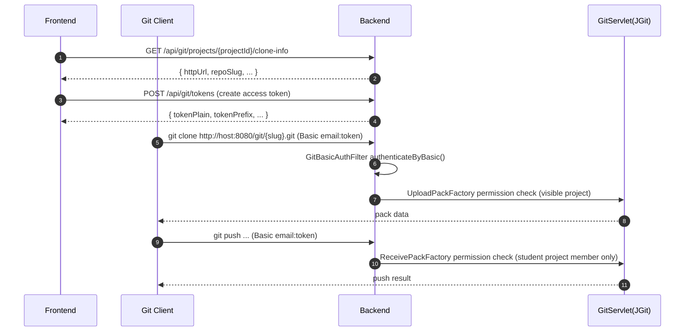
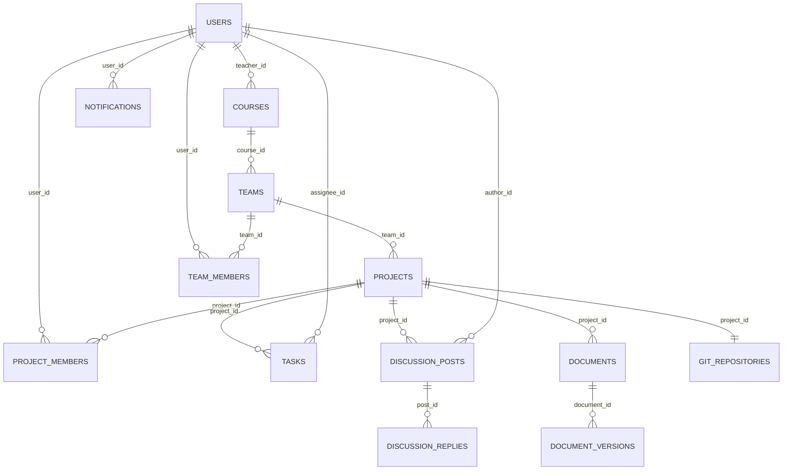

# EduCollab（交接向 / Mermaid 图完备版）

EduCollab 是一个面向课程团队协作的“一体化工作台”项目：**团队/项目/任务/讨论/协同文档/文件/通知/Git/AI** 全流程闭环。

本 README 面向 **团队接手/交接**：强调模块边界、关键流程、接口锚点、环境变量与排障路径；并包含可在 GitHub/GitLab 直接渲染的 **Mermaid**：架构图 / 流程图 / 时序图 / ER 图。

> 历史说明：仓库已移除会议模块（无会议页面/表/AI/导航残留）。

---

## Tech Stack（以仓库为准）

| 模块 | 技术栈 | 事实来源 |
|---|---|---|
| Frontend | React 19 + Vite 6 + React Router + React Query + Tailwind CSS + shadcn/base-ui | `frontend/package.json` |
| Backend | Spring Boot 3 + Spring Security（JWT）+ JPA + MySQL + JGit | `backend/pom.xml` / `backend/src/main/resources/application.yml` / `backend/src/main/java/com/educollab/common/config/GitHttpConfig.java` |
| Collab | Hocuspocus + Yjs + y-leveldb（LevelDB 持久化） | `collab-server/src/index.js` |

---

## 快速开始（Docker / 本机）

### 端口与地址速查（务必先看）

| 运行方式 | Frontend | Backend | Collab | MySQL |
|---|---:|---:|---:|---:|
| 本机开发（dev） | `http://localhost:3000` | `http://localhost:8080` | `ws://localhost:1234` | `localhost:3306` |
| Docker 演示（compose） | `http://localhost:5173`（容器内 Nginx 80） | `http://localhost:8080` | `ws://localhost:1234` | `localhost:3306` |

事实来源：`scripts/dev-local-up.sh`、`docker-compose.yml`、`frontend/Dockerfile`

### 默认演示账号

- 学生：`alex@educollab.local` / `Password123!`
- 教师：`teacher@educollab.local` / `Password123!`

事实来源：`backend/src/main/java/com/educollab/service/DataInitializer.java`

### Docker Compose 一键演示（推荐给答辩/演示）

```bash
cd /Users/cake/toys/educollab
cp .env.example .env
docker compose up --build
```

事实来源：`docker-compose.yml`、`.env.example`

### 纯本机一键启动（推荐给开发调试）

依赖：MySQL、Node.js、npm、Java 21、Maven

```bash
cd /Users/cake/toys/educollab
chmod +x scripts/*.sh
./scripts/dev-local-up.sh
```

停止：

```bash
cd /Users/cake/toys/educollab
./scripts/dev-local-down.sh
```

日志目录：`.local-run/`（脚本会写 `backend.log` / `frontend.log` / `collab-server.log`）

事实来源：`scripts/dev-local-up.sh`、`scripts/dev-local-down.sh`、`scripts/init-local-db.sh`

---

## 系统架构图（Mermaid / 架构图）

```mermaid
flowchart LR
  U[User Browser] --> FE[Frontend<br/>React + Vite]

  FE -->|REST JSON<br/>/api/*| BE[Backend<br/>Spring Boot]
  FE -->|WebSocket<br/>Yjs (Hocuspocus)| CS[Collab Server<br/>Hocuspocus]

  BE --> DB[(MySQL 8)]
  BE --> FS[(File Storage<br/>/app/data/uploads)]
  BE --> GR[(Git Bare Repos<br/>/app/data/repos)]
  BE -->|HTTP| AI[(OpenAI-compatible<br/>/chat/completions)]

  CS --> CL[(LevelDB<br/>collab state)]
```

关键锚点：
- Docker 部署与端口：`docker-compose.yml`
- 后端配置（DB/JWT/文件/Git/AI）：`backend/src/main/resources/application.yml`
- 协同服务持久化（LevelDB）：`collab-server/src/index.js`

---

## 关键业务流程（Mermaid / 流程图）

以“项目空间日常使用闭环”为主线（交接最常用路径）：

```mermaid
flowchart TD
  A[登录 / 注册<br/>/api/auth/*] --> B[Dashboard<br/>/api/projects/dashboard]
  B --> C[项目详情<br/>/api/projects/{id}]
  C --> D[任务管理<br/>/api/tasks/*]
  C --> E[讨论区<br/>/api/discussions/*]
  C --> F[文档中心<br/>/api/documents/* + ws://collab/{collabKey}]
  C --> G[文件资产<br/>/api/files/*]
  C --> H[通知中心<br/>/api/notifications/*]
  C --> I{代码项目?}
  I -->|是| J[Git 仓库 / MR / Release<br/>/api/git/* + /git/*]
  I -->|否| K[跳过 Git]
  C --> L[AI 助手<br/>/api/ai/*]
```

API 入口锚点：`backend/src/main/java/com/educollab/controller/*`

---

## 关键时序图（Mermaid / 时序图）

### A）登录与鉴权（JWT）



事实来源：
- JWT 解析与 Principal 注入：`backend/src/main/java/com/educollab/common/security/JwtAuthenticationFilter.java`
- JWT 生成与解析：`backend/src/main/java/com/educollab/common/security/JwtService.java`
- SecurityFilterChain：`backend/src/main/java/com/educollab/common/config/SecurityConfig.java`
- 前端请求封装：`frontend/src/lib/api.ts`

### B）协同文档：实时编辑 + 自动保存 + 版本快照



事实来源：
- 协同服务 onLoad/onStore（LevelDB）：`collab-server/src/index.js`
- 文档 REST API：`backend/src/main/java/com/educollab/controller/DocumentController.java`
- 前端文档 API：`frontend/src/lib/api.ts`、`frontend/src/lib/mappers.ts`（`collabUrl = COLLAB_BASE/{collabKey}`）

### C）Git Clone / Pull / Push（Smart HTTP + Basic Token）



事实来源：
- `/git/*` Servlet 与 Upload/Receive 权限：`backend/src/main/java/com/educollab/common/config/GitHttpConfig.java`
- Basic Token 鉴权过滤器：`backend/src/main/java/com/educollab/common/security/GitBasicAuthFilter.java`
- Security 放行 `/git/**`：`backend/src/main/java/com/educollab/common/config/SecurityConfig.java`

---

## 数据模型（Mermaid ER 图，核心表聚焦）

> 完整表结构见：`backend/src/main/resources/schema.sql`（此处只画交接最常用的核心关系）



说明：
- `file_assets` 通过 `owner_type + owner_id` 绑定不同资源（PROJECT/TASK/DOCUMENT/DISCUSSION_POST），属于“多态关联”，此处不强行画 ER 关系线（见 `schema.sql` 字段定义）。
- 通知 `notifications` 与用户绑定（见 schema.sql：`user_id`）。

---

## 模块边界与接口锚点（交接重点）

### 边界表（职责与数据所有权）

| 模块 | 负责什么 | 不负责什么 | 关键锚点 |
|---|---|---|---|
| Frontend | 路由/视图/状态、调用后端 API、连接协同服务、展示 Git/AI 结果 | 不直接访问 DB/文件系统/裸仓 | `frontend/src/lib/api.ts`、`frontend/src/lib/mappers.ts` |
| Backend | 鉴权、业务聚合、持久化、文件上传下载、JGit 托管、AI 调用封装 | 不做 Yjs 同步（交给 collab-server） | `backend/src/main/java/com/educollab/controller/*`、`backend/src/main/resources/application.yml` |
| Collab Server | Yjs 文档实时同步与持久化（LevelDB） | 不做业务鉴权/权限（如需可扩展） | `collab-server/src/index.js` |

### API 概览（按 Controller 入口导航）

| 功能 | 前缀 | Controller（锚点） |
|---|---|---|
| 鉴权/会话 | `/api/auth/*` | `backend/src/main/java/com/educollab/controller/AuthController.java` |
| 用户/课程/团队 | `/api/users/*` `/api/courses/*` `/api/teams/*` | `UserController` / `CourseController` / `TeamController` |
| 项目/仪表盘 | `/api/projects/*` | `ProjectController` |
| 任务 | `/api/tasks/*` | `TaskController` |
| 讨论 | `/api/discussions/*` | `DiscussionController` |
| 文档（含版本） | `/api/documents/*` | `DocumentController` |
| 文件资产 | `/api/files/*` | `FileController` |
| 通知 | `/api/notifications/*` | `NotificationController` |
| 教师端 | `/api/teacher/*` | `TeacherController` |
| Git 管理 API | `/api/git/*` | `GitController` |
| Git Smart HTTP | `/git/*` | `GitHttpConfig`（Servlet 注册） |
| AI | `/api/ai/*` | `AiController` |

---

## 配置与环境变量（含坑点）

以 `.env.example` 为准（Docker / 本机都建议先复制一份 `.env`）：

```bash
cd /Users/cake/toys/educollab
cp .env.example .env
```

### 变量速查

| 变量 | 用途 | 事实来源 |
|---|---|---|
| `DB_URL` / `DB_USERNAME` / `DB_PASSWORD` | 后端数据源 | `.env.example` / `backend/src/main/resources/application.yml` |
| `JWT_SECRET` | JWT 签名密钥（建议 ≥ 32 bytes） | `.env.example` / `application.yml` |
| `AI_PROVIDER` / `AI_BASE_URL` / `AI_API_KEY` / `AI_MODEL` | AI Provider（OpenAI-compatible） | `.env.example` / `backend/src/main/java/com/educollab/service/AiService.java` |
| `FILE_STORAGE_ROOT` / `GIT_REPO_ROOT` | 文件上传与裸仓根目录（Docker 默认 `/app/data/*`） | `.env.example` / `docker-compose.yml` / `application.yml` |
| `COLLAB_PORT` / `COLLAB_DATA_DIR` | 协同服务端口与 LevelDB 目录 | `.env.example` / `collab-server/src/index.js` |
| `VITE_API_BASE_URL` / `VITE_COLLAB_BASE_URL` | 前端连接后端与协同服务的基址 | `.env.example` / `frontend/src/lib/mappers.ts` |

### 坑点：`VITE_API_BASE_URL` 可以写到 `/api`，前端会自动去重

`.env.example` 默认是 `VITE_API_BASE_URL=http://localhost:8080/api`。前端会把末尾 `/api` 规范化，避免出现 `/api/api/...`。

事实来源：`frontend/src/lib/mappers.ts`（`normalizeApiBase()`）

---

## 排障 Runbook（常见问题快速定位）

1) **端口占用**
- 本机 dev：3000/8080/1234/3306
- Docker：5173/8080/1234/3306

2) **本机 MySQL 未启动**
- `scripts/dev-local-up.sh` 会提示：`brew services start mysql`

3) **AI 调用失败 / 没配置 Key**
- 后端会明确报错：`AI 模型未配置，请设置 API Key`
- 入口：`AiService.ask()`（`backend/src/main/java/com/educollab/service/AiService.java`）

4) **Git clone/push 401/403**
- `/git/*` 走 Basic Token（不是 JWT）
- 权限规则：项目可见性（读）+ 学生项目成员（写），教师只读
- 锚点：`GitHttpConfig`、`GitBasicAuthFilter`

5) **协同文档不同步/丢数据**
- 检查 `VITE_COLLAB_BASE_URL` 是否指向正确 ws 地址
- Collab 持久化目录：`COLLAB_DATA_DIR`（默认 `collab-server/data/` 或 Docker 的 `/app/data/collab`）
- 锚点：`collab-server/src/index.js`

> 备注：后端存在 `WebSocketConfig`（`/ws/notifications` STOMP broker），当前仓库未见业务侧消息推送实现；请视为预留扩展点，不作为已上线能力承诺。

---

## 测试与质量门禁（轻量）

### 前端

```bash
cd /Users/cake/toys/educollab/frontend
npm run build
npm run lint
```

### 后端

```bash
cd /Users/cake/toys/educollab/backend
mvn -Dmaven.repo.local=/tmp/educollab-m2 test
```

### 最小冒烟 Checklist（交接必跑）

- [ ] 能用默认账号登录
- [ ] 能进入 Dashboard 并打开项目详情
- [ ] 能创建/更新一个任务
- [ ] 能打开文档并产生 autosave（查看 Network 调用 `/api/documents/{id}/autosave`）
- [ ] 代码项目能看到 clone-info，并能用 token 进行 git clone（只需验证一次）

---

## 仓库目录说明

```text
/Users/cake/toys/educollab
├── frontend/        # React 前端（Vite dev: 3000 / Docker: Nginx 80->5173）
├── backend/         # Spring Boot 后端（8080）
├── collab-server/   # Hocuspocus 协同服务（1234）
├── scripts/         # 本机一键启动脚本（.local-run 日志）
├── docker-compose.yml
└── .env.example
```
