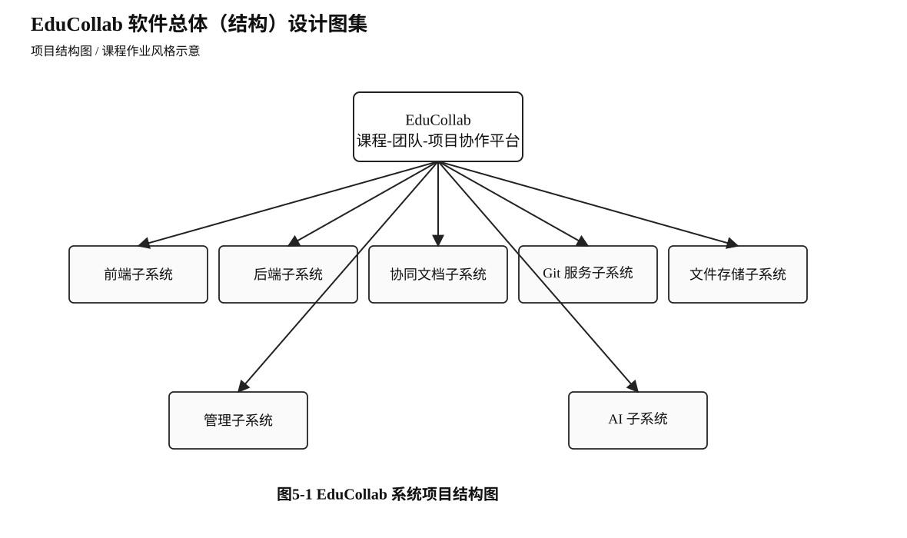
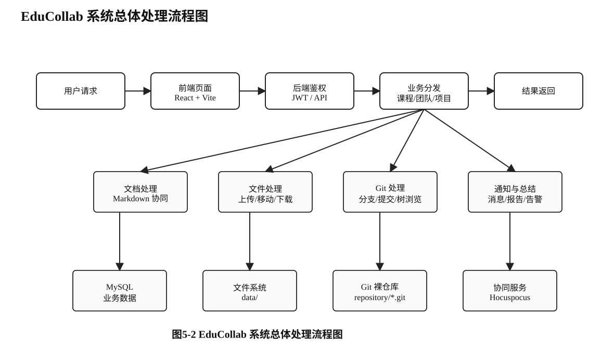
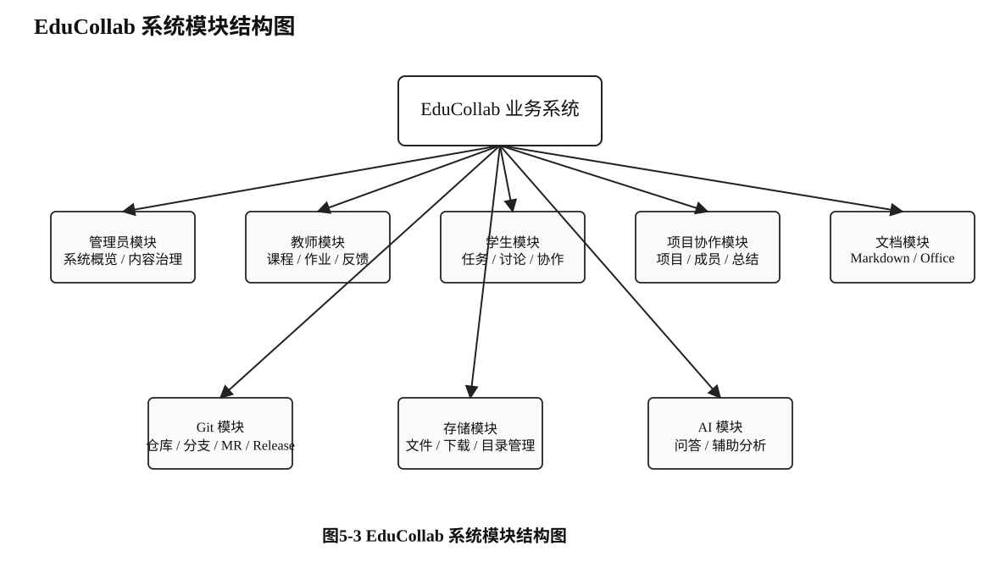
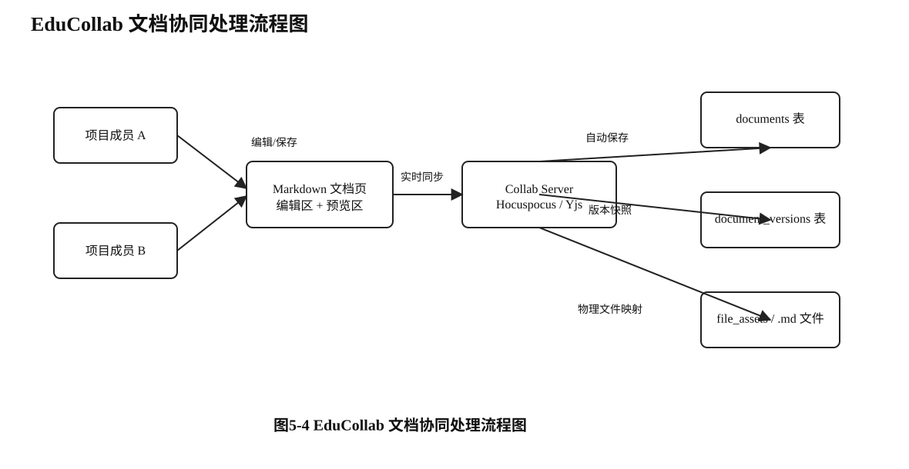
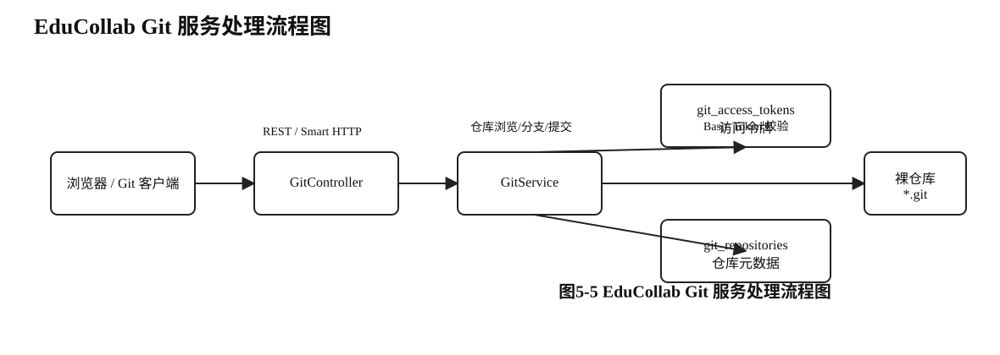
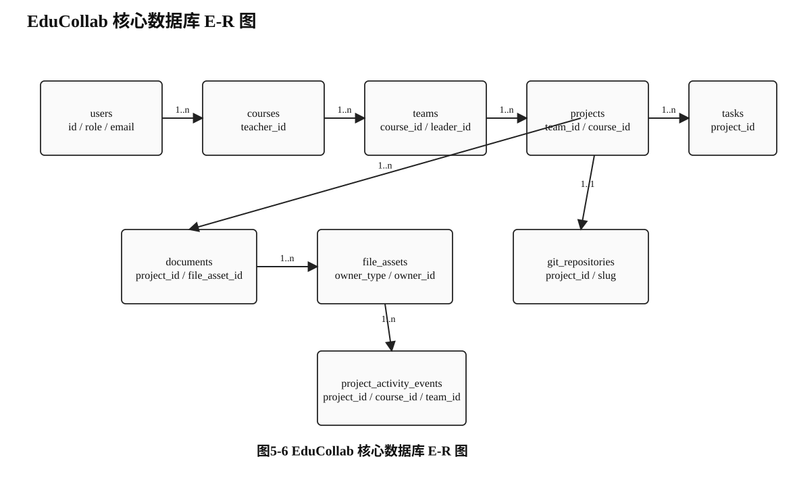
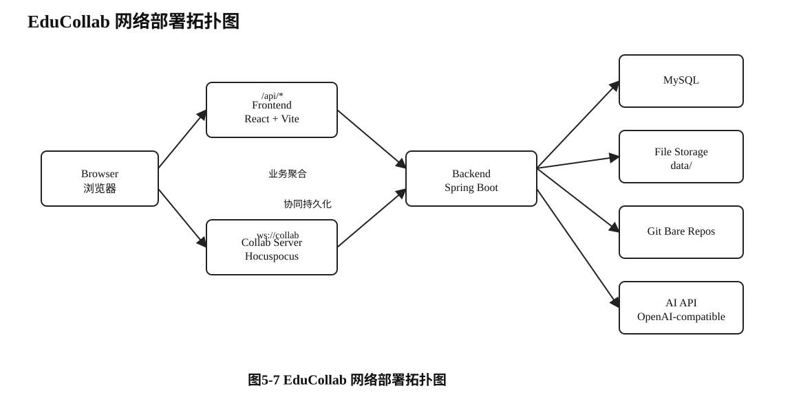
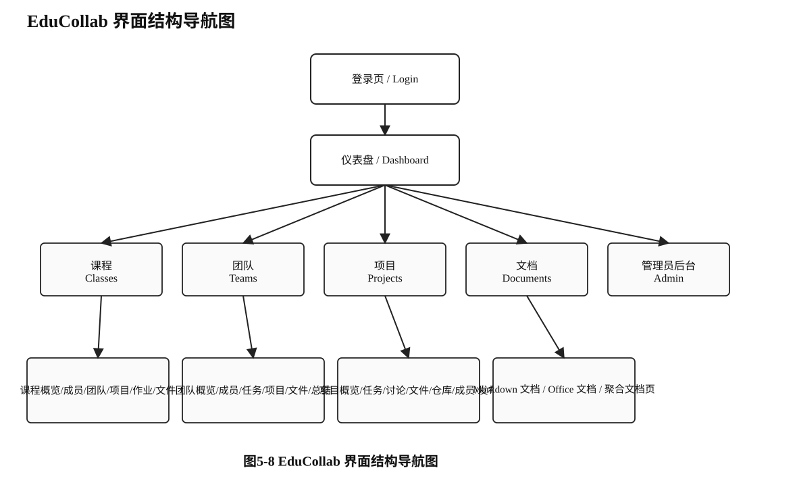

# 实验五 软件总体（结构）设计

## 一、实验内容

进行 EduCollab 软件系统的总体结构设计，并对主要模块进行程序描述，包括各模块的功能、性能特征、输入、输出、处理逻辑与接口关系等内容。具体包括：

1. 对 EduCollab 软件应用系统进行总体结构设计。
2. 在系统总体设计的基础上完成子系统及模块总体设计。
3. 完成主要相关数据库、网络、界面总体（概要）设计。
4. 按实验要求形成完整的总体（概要）设计文档。

## 二、实验目的与要求

1. 结合选题，加深对软件系统总体设计阶段任务与过程的理解。
2. 在真实仓库实现的基础上完成子系统与模块设计，不写空泛模板。
3. 完成数据库、网络、界面与部署结构的概要设计说明。
4. 写出结构清晰、图文对应、可用于课程提交的总体设计文档。

## 三、实验结果

# 系统概要设计说明

## 1 引言

### 1.1 标识

本文档名称为《EduCollab 软件总体（结构）设计说明》。EduCollab 是一个面向课程教学、团队协作与项目实践的综合协作平台，支持课程组织、团队管理、项目协同、任务管理、讨论交流、文档协作、文件管理、代码仓库、教师视图与管理员治理等核心能力。

### 1.2 系统概述

EduCollab 的目标是为课程项目制教学提供统一平台。系统以“课程 → 团队 → 项目”为业务主结构，围绕项目协作闭环组织功能。学生可在项目中进行任务拆解、讨论交流、文档编写、文件管理和代码协作；教师可查看课程、团队、项目与作业进展；管理员可从后台查看系统状态并接管全部业务入口。

从技术架构看，系统由三个核心运行单元组成：

- 前端：React 19 + Vite 6，负责页面交互、路由和状态管理。
- 后端：Spring Boot 3，负责鉴权、业务逻辑、数据库读写、文件管理与 Git 服务封装。
- 协同服务：Hocuspocus + Yjs，负责 Markdown 协同文档的实时同步与持久化。

### 1.3 文档概述

本文档从总体设计角度说明 EduCollab 的结构组成、主要模块、数据库设计、网络部署、界面结构和运行维护方式。文中重点关注真实系统已实现的模块边界与数据流转过程，不展开到详细设计和逐函数伪代码层面。

### 1.4 基线

本说明书主要依据以下设计基线编写：

1. 当前项目根目录 `README.md` 中的架构说明、关键流程和技术栈描述。
2. 前端 `frontend/src/routes/index.tsx` 与 `frontend/src/screens/*` 中的页面结构。
3. 后端 `backend/src/main/java/com/educollab/controller/*`、`service/*`、`model/*`、`repo/*` 中的业务实现。
4. 数据库定义文件 `backend/src/main/resources/schema.sql`。
5. 协同服务 `collab-server/src/index.js` 与文件/Git 存储相关服务实现。

## 2 引用文件

[1] 《计算机软件文档编制规范（GB/T 8567-2006）》，中华人民共和国国家质量监督检验检疫总局、中国国家标准化管理委员会，2006年发布。  
[2] 《软件工程与实践（第4版·新形态）》，贾铁军、李学相、王学军、陈国秦、李宇佳、王贵鑫，清华大学出版社，2022.07。  
[3] EduCollab 项目 README 与源码实现，路径为 `/Users/cake/toys/educollab`。

## 3 总体设计

### 3.1 基本功能

EduCollab 的基本功能如下：

1. **用户与鉴权功能**：提供登录、身份识别和基于角色的权限控制，角色包括管理员、教师和学生。
2. **课程管理功能**：支持课程创建、成员管理、课程概览、课程文件、课程团队和课程项目浏览。
3. **团队协作功能**：支持团队概览、成员查看、团队任务、团队项目、团队总结与团队文件管理。
4. **项目协作功能**：支持项目概览、成员管理、任务拆解、讨论交流、文件管理、文档协作、仓库浏览与发布管理。
5. **文档功能**：支持 Markdown 协同文档和 Office 文档管理，Markdown 文档通过协同服务进行实时同步。
6. **文件管理功能**：支持按课程、团队、项目层级组织文件，支持目录浏览、上传、下载、移动、重命名和删除。
7. **代码仓库功能**：支持项目仓库初始化、分支查看、提交记录浏览、代码树浏览、Merge Request 和 Release 管理。
8. **教师业务功能**：支持教师仪表盘、作业、反馈与总结查看。
9. **管理员功能**：支持系统概览、用户管理、课程管理、团队管理、项目管理、内容治理、存储浏览和系统维护。
10. **通知功能**：支持消息与通知列表、通知详情展示。

### 3.2 附加功能

系统除基本功能外，还实现了以下附加功能：

1. **Markdown 实时协同**：通过 Hocuspocus + Yjs 实现多用户同时编辑与自动同步。
2. **Git Smart HTTP**：通过后端提供 HTTP Clone / Pull / Push 入口，并结合访问令牌控制权限。
3. **项目总结/报告能力**：支持项目级和团队级总结、贡献统计与报告展示。
4. **管理员治理能力**：支持内容治理中枢、管理员接管前台业务页面与系统监控。
5. **系统概览与健康检查**：支持管理员查看用户数、课程数、团队数、项目数及系统资源状态。
6. **AI 助手能力**：后端通过 OpenAI-compatible 接口为平台提供 AI 相关辅助能力。

### 3.3 运行环境

EduCollab 的运行环境包括：

| 层次 | 技术/环境 | 说明 |
|---|---|---|
| 前端 | React 19、Vite 6、TypeScript | 负责浏览器端页面展示与交互 |
| 后端 | Spring Boot 3、Spring Security、JPA | 负责 REST API、鉴权、业务聚合 |
| 协同服务 | Hocuspocus、Yjs、y-leveldb | 负责协同文档实时同步与持久化 |
| 数据库 | MySQL 8 | 保存用户、课程、项目、文档、任务等业务数据 |
| 文件存储 | `data/` 目录 | 保存课程/团队/项目文件、日志与系统数据 |
| Git 仓库 | 裸仓库存储 | 保存项目代码仓库、分支和提交对象 |
| AI 接口 | OpenAI-compatible HTTP API | 提供 AI 助手调用通道 |

### 3.4 基本设计概念和处理流程

EduCollab 采用前后端分离 + 协同服务拆分的总体设计思路。其基本设计概念如下：

1. **业务结构主线固定**：以课程为组织单元，课程下可建立团队，团队下承载项目；无团队项目也可直接挂在课程下。
2. **前端负责视图与流程组织**：浏览器端统一通过路由管理课程、团队、项目、文档、文件、仓库和后台界面。
3. **后端负责真实业务处理**：后端控制权限校验、数据库操作、文件系统访问、Git 仓库访问与系统管理接口。
4. **协同服务负责实时同步**：Markdown 文档的实时编辑由协同服务维护状态，后端负责持久化业务元数据。
5. **文件与仓库采用真实物理资源**：文件管理依赖真实文件系统目录，仓库浏览依赖真实 Git 裸仓库。
6. **管理员拥有最高权限**：管理员可通过后台治理入口进入前台业务页面并执行最高权限操作。

整个项目结构如下图 5-1 所示。

系统总体处理流程如图 5-2 所示。

## 4 系统模块结构

EduCollab 的系统模块结构如图 5-3 所示。

### 4.1 前端子系统

前端子系统位于 `frontend/src`，采用路由驱动页面组织。其主要模块包括：

- 登录模块：`/login`
- 仪表盘模块：`/app/dashboard`
- 课程模块：`/app/classes/*`
- 团队模块：`/app/teams/*`
- 项目模块：`/app/projects/*`
- 文档模块：`/app/documents` 与项目文档工作台
- 管理员模块：`/app/admin/*`

前端子系统功能、输入、输出与接口关系如下：

| 项目 | 描述 |
|---|---|
| 功能 | 负责页面路由、表单交互、状态展示、文件浏览、仓库浏览和文档编辑界面 |
| 性能/特性 | 支持单页应用路由跳转、异步数据加载和前后端分离部署 |
| 输入 | 用户点击、表单数据、文件上传、API 返回数据、WebSocket 协同消息 |
| 输出 | 页面视图、表单提交、REST 请求、协同编辑事件 |
| 主要接口 | `/api/auth/*`、`/api/projects/*`、`/api/documents/*`、`/api/storage/*`、`/api/git/*` |

### 4.2 后端业务子系统

后端子系统位于 `backend/src/main/java/com/educollab`，主要分为 Controller、Service、Model、Repo 四层。

- **Controller 层**：对外提供 REST API，如 `AuthController`、`ProjectController`、`DocumentController`、`GitController`、`StorageController`、`AdminController`。
- **Service 层**：处理业务逻辑，如 `DocumentService`、`GitService`、`StorageService`、`AdminService`、`WorkspaceService`。
- **Model 层**：定义持久化实体，如 `UserEntity`、`ProjectEntity`、`DocumentEntity`、`FileAssetEntity`、`GitRepositoryEntity`。
- **Repo 层**：通过 JPA Repository 完成数据库访问。

| 项目 | 描述 |
|---|---|
| 功能 | 鉴权、业务处理、数据库读写、文件管理、Git 管理、管理员维护 |
| 性能/特性 | 采用统一服务层封装业务，支持基于角色与项目成员关系的权限判定 |
| 输入 | 前端 REST 请求、上传文件、Git HTTP 请求、管理员维护操作 |
| 输出 | JSON DTO、下载流、错误响应、Git 操作结果 |
| 主要接口 | `/api/*` 与 `/git/*` |

### 4.3 协同文档模块

协同文档模块由前端 Markdown 文档页、后端文档元数据管理和 Hocuspocus 协同服务共同组成。Markdown 文档通过 `collab_key` 标识协同通道，内容在协同服务中实时同步，并由后端执行自动保存和版本快照。

文档协同流程如图 5-4 所示。

| 项目 | 描述 |
|---|---|
| 功能 | Markdown 实时协同编辑、自动保存、版本快照、附件关联 |
| 性能/特性 | 支持多人实时同步，协同状态使用 LevelDB 持久化 |
| 输入 | 编辑内容、自动保存请求、版本保存请求、附件上传 |
| 输出 | 文档内容更新、版本记录、物理 `.md` 文件映射 |
| 主要接口 | `/api/documents/*`、`ws://collab/:collabKey` |

### 4.4 Git 服务模块

Git 服务模块通过 `GitController` 与 `GitService` 提供仓库初始化、分支查看、提交记录读取、代码树读取、Merge Request 和 Release 管理，并通过访问令牌支持 Git 客户端使用 Smart HTTP 协议执行 clone / pull / push。

Git 服务处理流程如图 5-5 所示。

| 项目 | 描述 |
|---|---|
| 功能 | 项目仓库初始化、分支查看、提交历史、代码浏览、MR、Release、访问令牌 |
| 性能/特性 | 以真实裸仓库作为数据源，不依赖伪造文件树 |
| 输入 | 项目 ID、ref、path、访问令牌、Git 客户端请求 |
| 输出 | 分支列表、提交列表、树节点、blob 内容、仓库地址 |
| 主要接口 | `/api/git/*`、`/git/*.git` |

### 4.5 文件与文档管理模块

文件与文档管理模块的核心是 `StorageController`、`StorageService`、`StoragePathService` 与 `FileController`。该模块负责按课程、团队、项目层级组织文件系统目录，并向前端 Explorer 提供真实目录内容。项目目录固定包含 `files/`、`repository/`、`system/` 等子目录。

| 项目 | 描述 |
|---|---|
| 功能 | 目录浏览、文件上传、下载、移动、重命名、删除，文档文件识别与聚合 |
| 性能/特性 | 以真实文件系统为准，数据库仅补充归属与元数据 |
| 输入 | scopeType、scopeId、path、上传文件、批量操作请求 |
| 输出 | 目录项列表、下载资源流、路径变更结果 |
| 主要接口 | `/api/storage/*`、`/api/files/*` |

### 4.6 管理员模块

管理员模块分为系统概览、用户管理、课程/团队/项目管理、内容治理、存储浏览、导入与系统维护等部分，主要通过 `AdminController` 和前端 `/app/admin/*` 页面实现。

| 项目 | 描述 |
|---|---|
| 功能 | 系统监控、用户管理、课程管理、团队管理、项目管理、内容治理、系统维护 |
| 性能/特性 | 管理员拥有最高权限，可接管前台业务页面 |
| 输入 | 管理员维护请求、筛选条件、导入文件、维护操作 |
| 输出 | 概览指标、治理入口、维护结果、告警信息 |
| 主要接口 | `/api/admin/*` |

## 5 数据库设计

### 5.1 创建数据库

EduCollab 使用 MySQL 作为核心业务数据库。数据库中保存用户、课程、团队、项目、任务、讨论、文档、文件元数据、通知、作业、Git 元数据、系统审计和 AI 使用记录等数据。系统启动后根据 `schema.sql` 自动初始化主要表结构。

### 5.2 创建表

数据库核心结构如图 5-6 所示。

结合 `backend/src/main/resources/schema.sql`，系统中的主要数据表如下：

| 表名 | 作用 |
|---|---|
| `users` | 保存用户基本信息、角色、偏好设置 |
| `courses` | 保存课程信息及教师归属 |
| `class_members` | 保存课程成员与角色 |
| `teams` | 保存团队信息、队长与课程关联 |
| `team_members` | 保存团队成员关系 |
| `projects` | 保存项目主信息、项目状态与进度 |
| `project_members` | 保存项目成员关系 |
| `project_milestones` | 保存项目里程碑信息 |
| `tasks` | 保存项目任务 |
| `task_comments` | 保存任务评论 |
| `discussion_posts` | 保存项目讨论主题 |
| `discussion_replies` | 保存讨论回复 |
| `documents` | 保存文档主信息、协同键、文件绑定 |
| `document_versions` | 保存文档版本快照 |
| `file_assets` | 保存文件元数据、归属、相对路径和可见性 |
| `assignments` | 保存课程或项目作业信息 |
| `assignment_submissions` | 保存作业提交记录 |
| `git_repositories` | 保存项目仓库元数据 |
| `merge_requests` | 保存合并请求 |
| `project_releases` | 保存版本发布记录 |
| `git_access_tokens` | 保存 Git 访问令牌 |
| `project_activity_events` | 保存项目活动日志与贡献数据 |
| `notifications` | 保存通知消息 |
| `storage_nodes` | 保存存储锚点与系统目录元信息 |

数据库设计采用“业务表 + 元数据表 + 关联表”相结合的方式。其中项目、任务、讨论、文档和文件构成项目协作主链路；课程、团队和项目之间形成层次组织结构；文档、文件、仓库和活动事件共同构成项目工作台的数据基础。

## 6 数据库安全性

### 6.1 概述

EduCollab 的数据库安全性主要依赖于角色权限控制、业务层校验和资源归属约束。前端不能直接访问数据库，所有数据库读写均通过后端服务进行。

### 6.2 数据库验证方式

1. **用户身份验证**：系统使用 JWT 完成身份验证，用户登录成功后才能访问主要业务接口。
2. **角色权限控制**：管理员、教师和学生具有不同的数据访问能力。
3. **课程与项目归属校验**：后端在 Service 层检查当前用户是否为课程成员、团队成员或项目成员。
4. **资源可见性约束**：文件、文档、系统目录、项目仓库等资源根据归属对象和角色判断可见性。
5. **管理员 override**：管理员接口通过 `@PreAuthorize("hasRole('ADMIN')")` 进行保护，管理员可查看并维护全部数据。

## 7 数据库管理和设置

### 7.1 概述

EduCollab 的数据库管理与系统运行维护是结合进行的。除 MySQL 业务数据外，平台还需要维护文件目录、仓库目录、协同状态目录和活动日志目录。

### 7.2 数据库属性设置

数据库主要属性设置包括：

- 数据库类型：MySQL 8
- 字符集：UTF-8
- 主键策略：自增主键为主
- 时间字段：统一使用 `created_at`、`updated_at`
- 唯一约束：如用户邮箱、协同键、项目成员唯一性、访问令牌等
- 索引设置：对活动日志、提交记录等高频查询字段建立索引

### 7.3 数据库备份恢复策略

系统的备份恢复策略应包括：

1. **数据库备份**：定期备份 MySQL 数据库，保证课程、项目、任务、文档和权限信息可恢复。
2. **文件系统备份**：对 `data/` 目录进行增量备份，保证课程/团队/项目文件、日志与附件不丢失。
3. **仓库备份**：对项目裸仓库目录定期打包备份，保证历史提交和分支可恢复。
4. **协同状态备份**：对 `collab-server/data/collab` 进行持久化备份，保证协同文档实时状态恢复。
5. **恢复顺序**：先恢复数据库，再恢复文件目录和仓库目录，最后恢复协同状态数据。

### 7.4 数据库运行日常维护

数据库与系统日常维护主要包括：

- 定期检查用户、课程、团队、项目等核心表的完整性。
- 检查 `project_activity_events`、`notifications` 等日志类表的数据增长情况。
- 检查文件目录、仓库目录和日志目录是否与数据库元数据一致。
- 检查 Git 访问令牌、文档绑定关系、作业提交关联关系是否正常。
- 通过管理员后台执行系统扫描、内容治理、系统概览查看与维护动作。

## 8 注解

### 8.1 定义

- **课程（Course）**：教学组织单元，用于管理成员、团队、项目和作业。
- **团队（Team）**：课程中的协作小组，可拥有多个项目。
- **项目（Project）**：学生开展任务、讨论、文档协作和代码开发的核心工作空间。
- **协同文档（Markdown）**：支持多人实时编辑的 Markdown 文档。
- **Office 文档**：在文档工作台中单人编辑的 Office 文件。
- **文件资产（File Asset）**：与项目、讨论、作业或文档相关联的物理文件及其元数据。
- **Git 裸仓库**：项目代码仓库的真实存储形式，用于支持仓库浏览和 Smart HTTP。
- **内容治理**：管理员按课程、团队、项目结构进入真实业务界面的中枢入口。

### 8.2 参考资料

[1] 《软件工程与实践（第4版·新形态）》，清华大学出版社，2022。  
[2] EduCollab 项目根目录 `README.md`。  
[3] EduCollab 后端数据库结构文件 `backend/src/main/resources/schema.sql`。  
[4] EduCollab 前端路由文件 `frontend/src/routes/index.tsx`。  
[5] EduCollab 协同服务入口文件 `collab-server/src/index.js`。

## 9 网络与界面概要设计补充

### 9.1 网络部署拓扑

系统网络部署关系如图 5-7 所示。

其主要通信关系如下：

1. 浏览器与前端页面之间通过 HTTP 加载静态资源。
2. 前端通过 `/api/*` 向后端发起 REST 请求。
3. Markdown 协同文档通过 WebSocket 与协同服务建立连接。
4. 后端与 MySQL、文件系统、Git 仓库、AI 接口之间保持服务端连接。
5. Git 客户端通过后端暴露的 Smart HTTP 地址与真实裸仓库交互。

### 9.2 界面总体结构

系统界面导航结构如图 5-8 所示。

界面设计的主要思路是：

- 登录后进入仪表盘，再由仪表盘进入课程、团队、项目、文档和后台。
- 课程页面聚焦教学组织与课程资源。
- 团队页面聚焦小组协作与团队工作台。
- 项目页面聚焦任务、讨论、文件、文档和仓库。
- 管理员后台聚焦系统概览、治理和维护入口。

## 四、总结

通过本次实验，对 EduCollab 的系统总体结构进行了较为完整的分析与整理。系统的优势主要体现在以下几个方面：

1. 业务主线清晰，以“课程 → 团队 → 项目”为中心组织全部协作功能。
2. 前端、后端和协同服务边界明确，系统结构具有较好的分层性。
3. 文档、文件和 Git 仓库能力较完整，能够支撑课程项目制教学的真实协作场景。
4. 管理员后台已具备系统概览、内容治理和维护入口，便于统一管理。

同时，系统仍存在需要继续完善的方面：

1. 文件系统、仓库展示和文档链路仍需持续保证与真实物理资源完全一致。
2. 部分模块的体验复杂度较高，后续可以继续优化界面统一性与流程简洁性。
3. 系统资源监控、异常告警和维护自动化能力还有进一步扩展空间。
4. 文档、文件、仓库和日志之间的关联分析仍可继续增强。

总体来看，EduCollab 已形成较完整的软件系统总体结构，适合作为课程协作平台的实验对象。通过本次概要设计，不仅加深了对系统结构设计方法的理解，也对如何从真实代码实现中抽象出系统级设计有了更深入的认识。后续若继续迭代，可以在性能、可维护性和运维自动化方面进一步提高系统质量。
